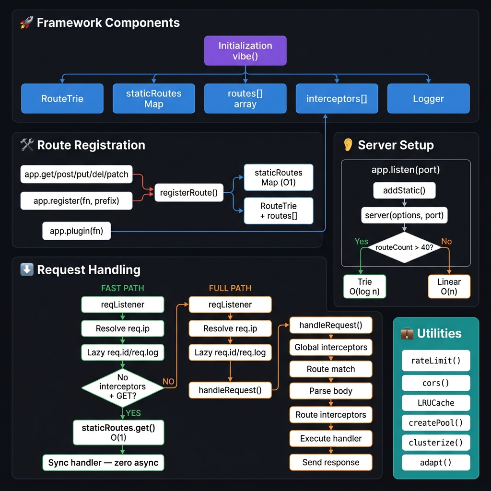

# Architecture

A visual overview of how Vibe handles initialization, route registration, and incoming requests.

## Summary

### Initialization
When `vibe()` is called, it sets up five internal data structures:
- **RouteTrie** — tree structure for O(log n) dynamic route matching
- **staticRoutes Map** — hash map for O(1) static route lookup
- **routes[] array** — fallback linear list used below the threshold
- **interceptors[]** — global middleware chain
- **Logger** — structured JSON logger instance

### Route Registration
Every `app.get()`, `app.post()`, `app.register()` call feeds into `registerRoute()` which populates all three data structures simultaneously. `app.plugin()` pushes directly into the interceptors chain.

### Server Setup (`app.listen`)
At startup, vibe checks `routeCount > 40`. If true, it uses **Trie matching O(log n)**. Otherwise **Linear matching O(n)**. This threshold switches automatically as your app grows.

### Request Handling — Two Paths

**Fast Path** (green) — Simple GET routes with no global interceptors:
1. Resolve `req.ip` (proxy-aware)
2. Define lazy `req.id` / `req.log` (no UUID generated yet)
3. Hit `staticRoutes.get()` in O(1)
4. Run handler synchronously — zero async/await overhead

**Full Path** (orange) — Everything else:
1. Same IP + lazy setup
2. Run global interceptors
3. Match route (static → trie → linear)
4. Parse request body
5. Run route-level interceptors
6. Execute handler
7. Send response

### Utilities
All exported helpers (`rateLimit`, `cors`, `LRUCache`, `createPool`, `clusterize`, `adapt`) plug into the interceptors chain or run alongside the server independently.
